# Movies List API

## Descripción

Movies List API es una aplicación que proporciona información sobre películas, incluyendo recomendaciones basadas en el título de la película, cantidad de filmaciones por mes y día, y estadísticas sobre actores y directores. La API está construida utilizando FastAPI y utiliza técnicas de procesamiento de lenguaje natural para recomendaciones de películas.

## Trabajo Realizado

### 1. Preparación de Datos

Se realizó una serie de transformaciones en los datos originales para preparar el conjunto de datos para su uso en la API. Esto incluyó:

- **Carga de Datos:** Cargar los datos desde archivos CSV.
- **Limpieza de Datos:** Eliminar filas con errores y convertir tipos de datos.
- **Desanidado de Datos:** Convertir columnas anidadas en listas de diccionarios a un formato más manejable.
- **Modificacion de Nombres:** Modificar los nombres de las peliculas que compartian este, agregandole el año de lanzamiento entre parentesis
- **Creación de DataFrames Específicos:** Crear DataFrames específicos para actores, directores y recomendaciones.
- **Exportación de Datos:** Guardar los DataFrames transformados en archivos CSV para su uso en la API.

### 2. Desarrollo de la API

Se desarrolló una API utilizando FastAPI que proporciona varios endpoints para interactuar con los datos de películas:

- **Lista de Estrenos por mes:** Proporciona una lista de peliculas que dependen de su mes de estreno

- **Lista de Estrenos por dia:** Proporciona una lista de peliculas que dependen de su dia de estreno

- **Información de Score de Películas:** Proporciona información sobre el score de una película.

- **Información de Votos de Películas:** Proporciona información de los votos y promedio de estos de una pelicula

- **Estadísticas de Actores:** Proporciona información sobre la cantidad de películas, retorno total y promedio de retorno

- **Estadísticas de Directores:** Proporciona una lista de películas, fecha de lanzamiento, retorno individual costo y ganancia de un director.

- **Recomendaciones de Películas:** Utiliza un modelo KNN basado en TF-IDF para recomendar películas similares, ordenadas por similitud.

#### Manejo de Títulos Duplicados

Para evitar confusiones con títulos de películas duplicados, se realizó una modificación en los nombres de las películas que compartían el mismo título. A estos títulos se les agregó el año de lanzamiento entre paréntesis. Por ejemplo, si hay dos películas llamadas "The Great Escape", se modificarán a "The Great Escape (1963)" y "The Great Escape (2020)".

Al hacer una consulta por título, si el título proporcionado no coincide exactamente con ningún título en la base de datos, se mostrarán todas las opciones que contienen el texto ingresado. Esto permite al usuario seleccionar la película correcta de una lista de posibles coincidencias.

### 3. Despliegue

La API se desplegó utilizando Render, lo que permite a los usuarios acceder a la API a través de un enlace público.

## Uso

Puedes acceder a la API a través del siguiente enlace de Render:

[Movies List API en Render](https://proyecto-individual-henry-kzxy.onrender.com)

Una vez que la aplicación esté en funcionamiento, puedes acceder a la documentación interactiva de la API en:
- `https://proyecto-individual-henry-kzxy.onrender.com/docs` (Swagger UI)

### Obtener la cantidad de filmaciones por mes
- **Ejemplo de consulta:**
    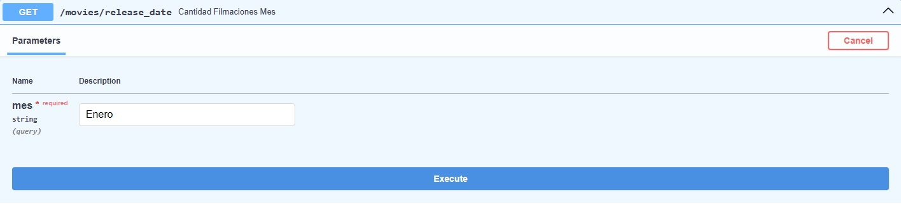
- **Ejemplo de salida:**
    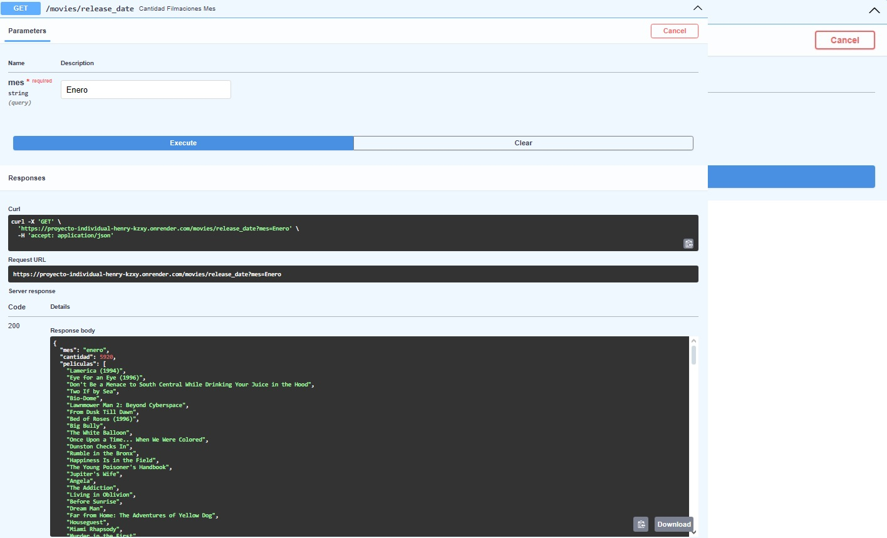

### Obtener la cantidad de filmaciones por día
- **Ejemplo de consulta:**
    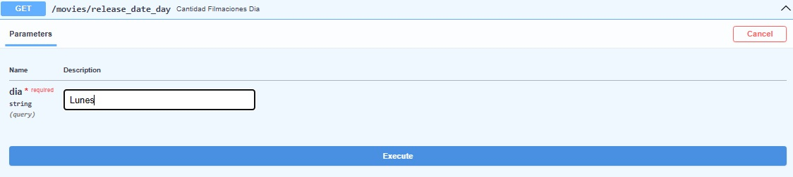
- **Ejemplo de salida:**
    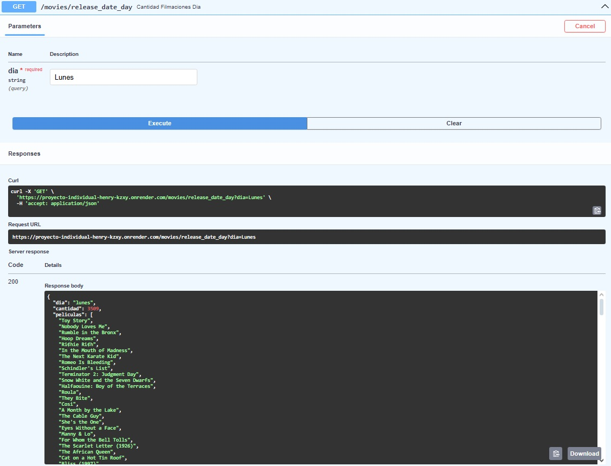

### Obtener el score de una película y el año de estreno
- **Ejemplo de consulta:**
    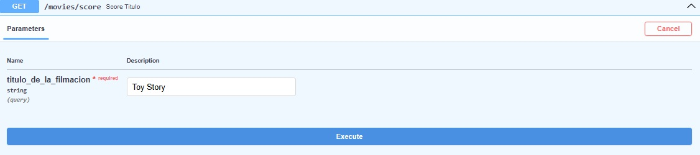
- **Ejemplo de salida:**
    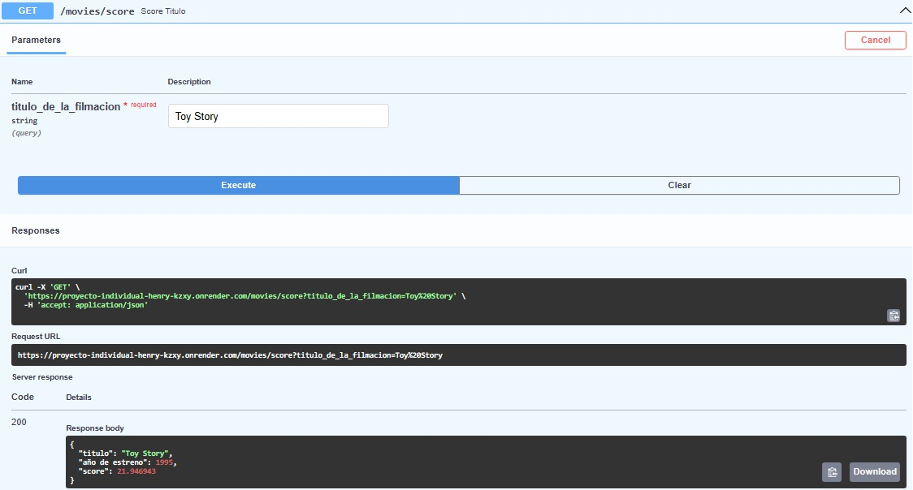

### Obtener el promedio de votos de una película
- **Ejemplo de consulta:**
    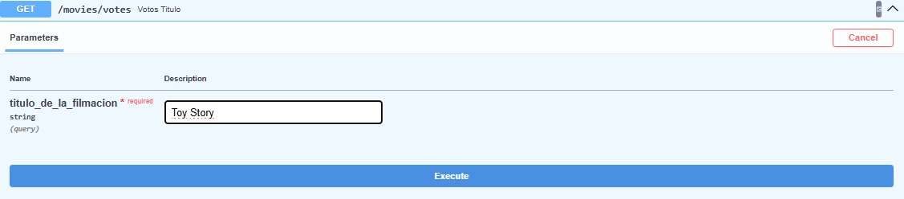
- **Ejemplo de salida:**
    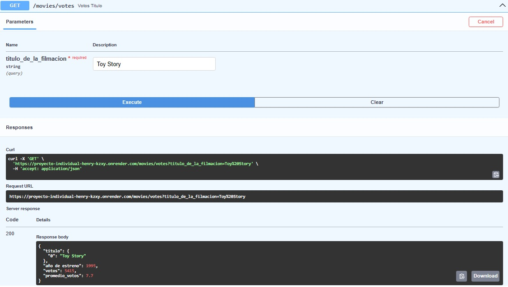

### Obtener estadísticas de un actor
- **Ejemplo de consulta:**
    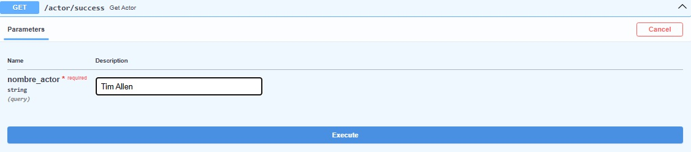
- **Ejemplo de salida:**
    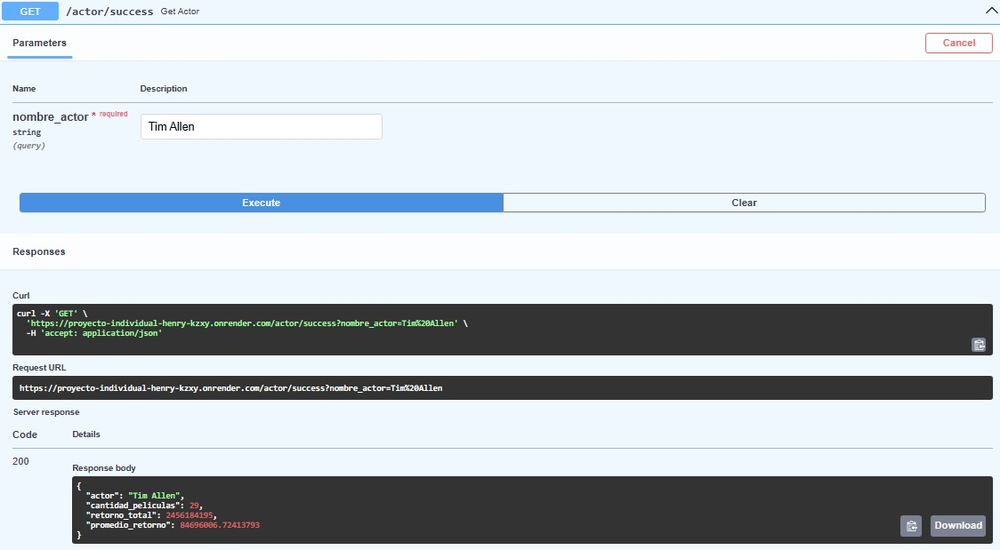

### Obtener estadísticas de un director
- **Ejemplo de consulta:**
    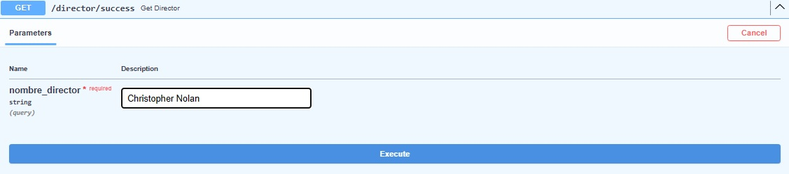
- **Ejemplo de salida:**
    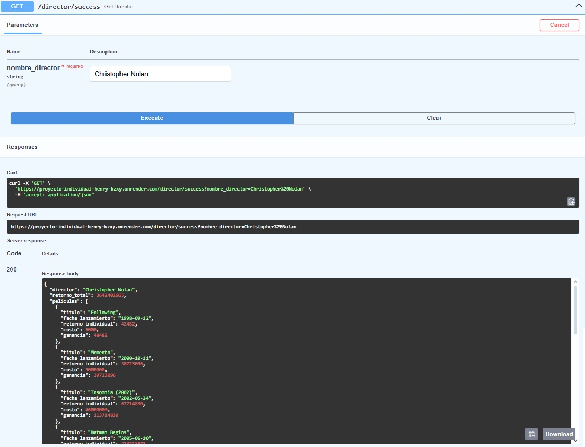

### Obtener recomendaciones de películas
- **Ejemplo de consulta:**
    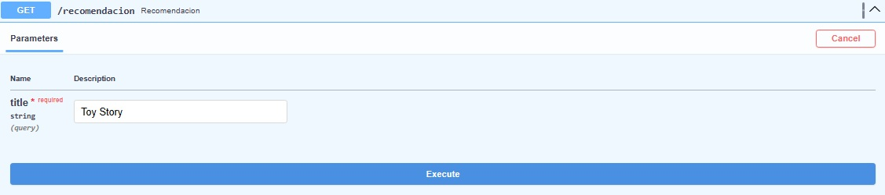
- **Ejemplo de salida:**
    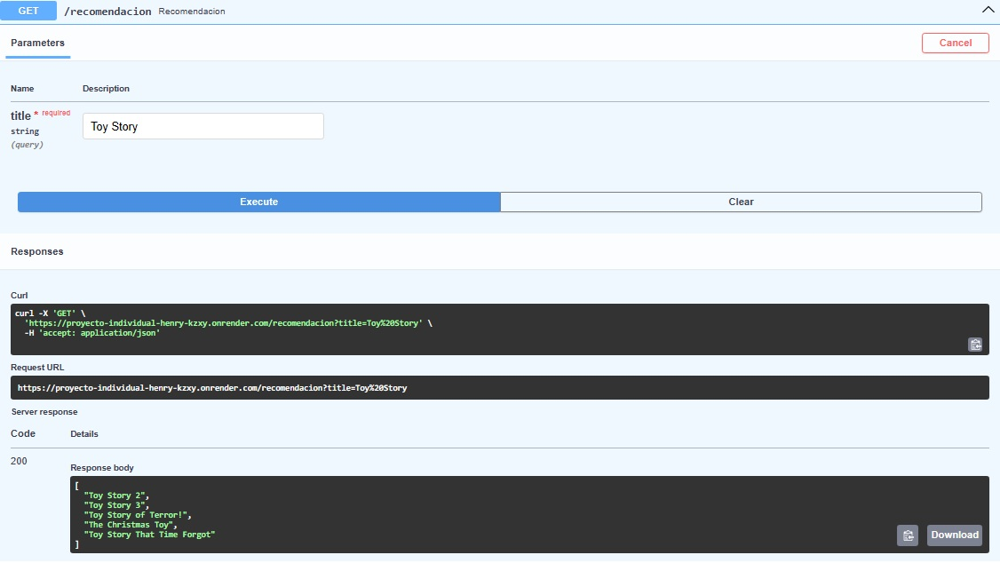

### Ejemplo de correccion de nombre
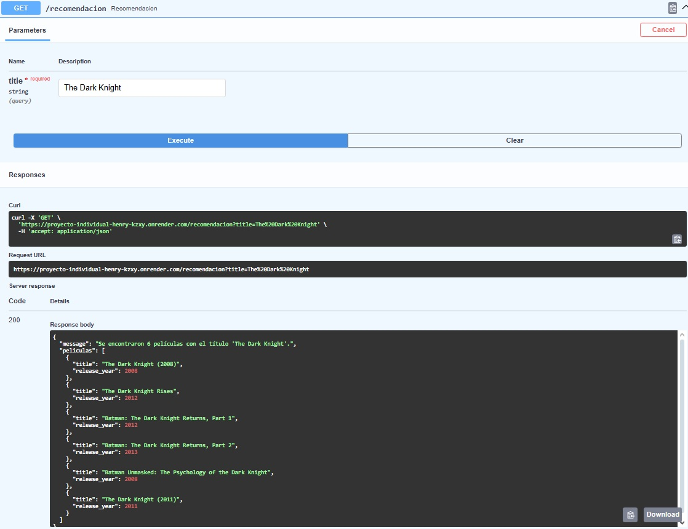